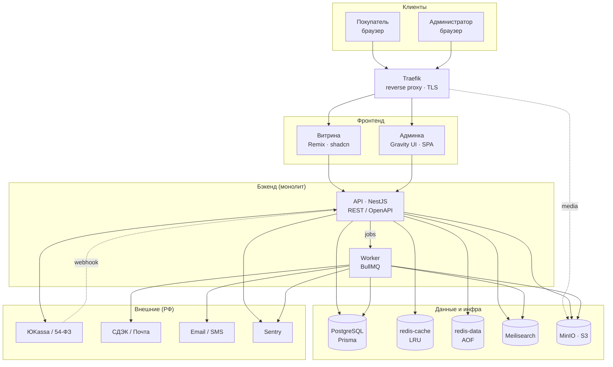
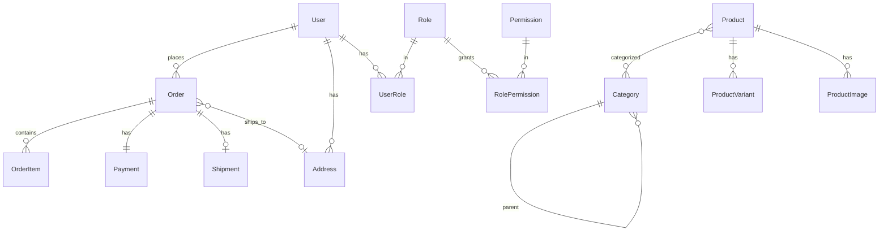
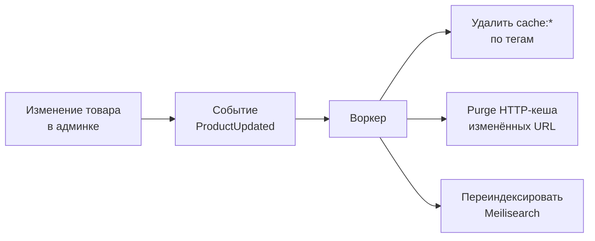
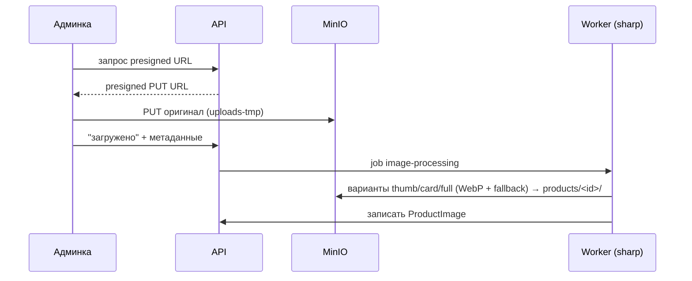
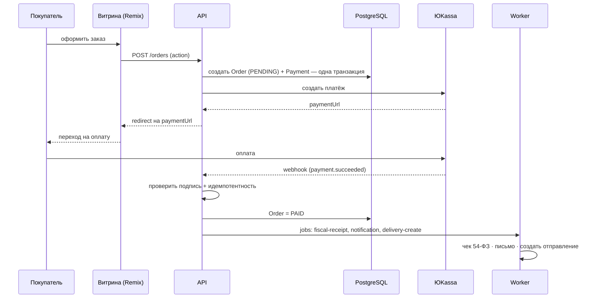

#  🛒 Интернет-магазин — Архитектура и технический стек

> Полное описание инфраструктуры, стеков и ключевых решений. MVP, e-commerce, один продавец, Россия.

## Содержание

1. [Обзор проекта](#1-обзор-проекта)
2. [Архитектурная схема](#2-архитектурная-схема)
3. [Репозитории (polyrepo)](#3-репозитории-polyrepo)
4. [Витрина (storefront)](#4-витрина-storefront)
5. [Админка (admin)](#5-админка-admin)
6. [Сервер (backend)](#6-сервер-backend)
7. [Валидация и контракты](#7-валидация-и-контракты)
8. [Аутентификация и безопасность](#8-аутентификация-и-безопасность)
9. [Доменная модель БД](#9-доменная-модель-бд)
10. [Кеширование](#10-кеширование)
11. [Поиск (Meilisearch)](#11-поиск-meilisearch)
12. [Медиа-пайплайн](#12-медиа-пайплайн)
13. [Очередь и фоновые задачи](#13-очередь-и-фоновые-задачи)
14. [Внешние интеграции](#14-внешние-интеграции)
15. [Ключевой поток: чекаут → оплата](#15-ключевой-поток-чекаут--оплата)
16. [DevOps / деплой](#16-devops--деплой)
17. [Ключевые решения и обоснования](#17-ключевые-решения-и-обоснования)
18. [Backlog](#18-backlog)

---

## 1. Обзор проекта

| Параметр | Значение |
|---|---|
| Тип | Классический e-commerce, один продавец |
| Масштаб | MVP, до ~1000 заказов/мес |
| Аудитория | Россия (₽, 54-ФЗ) |
| Разработка | Полностью кастомная |
| Организация кода | **Polyrepo** (отдельные репозитории), не монорепо |
| Бэкенд | **Модульный монолит** (не микросервисы) |
| Оркестрация | Docker Compose на VPS |
| Язык | TypeScript везде |

**Три поверхности:** витрина (покупатель), админка (сотрудники), сервер (вся бизнес-логика).

---

## 2. Архитектурная схема



---

## 3. Репозитории (polyrepo)

| Репозиторий | Содержимое | Домен |
|---|---|---|
| `shop-storefront` | Витрина на Remix | `shop.ru` |
| `shop-admin` | Админка на Gravity UI | `admin.shop.ru` |
| `shop-server` | Монолит NestJS (API + worker) | `api.shop.ru` |
| `shop-deploy` | `docker-compose`, `.env`, Traefik | — |

Контракты между репозиториями синхронизируются через OpenAPI-кодоген (без общего npm-пакета — см. §7).

---

## 4. Витрина (storefront)

| Область | Решение |
|---|---|
| Фреймворк | **Remix (React Router 7)**, SSR / BFF |
| UI-кит | **shadcn/ui** (копируемые компоненты) + **Tailwind** + Radix primitives |
| Идёт со shadcn | `lucide-react`, `tailwindcss-animate`, `class-variance-authority` + `clsx` + `tailwind-merge` |
| Данные | Только Remix `loader` / `action` / `useFetcher` (без TanStack Query) |
| Корзина / состояние | **Серверная в Redis** по сессии (resource route + `useFetcher`, optimistic UI через `fetcher.formData`) |
| Формы | **Zod + react-hook-form** + `@hookform/resolvers` (`zodResolver`) |
| Карусель | `embla-carousel-react` (галерея фото, подборки) |
| Тосты | `sonner` («добавлено в корзину», ошибки) |
| Анимации | `framer-motion` |
| Тема | **`remix-themes`** — тема из cookie, без вспышки на SSR |

**Ключевые паттерны:**
- Каталог и карточки рендерятся SSR + отдают HTTP-кеш заголовки (см. §10).
- Серверная валидация в Remix `action` обязательна; клиентский Zod — только UX.
- Корзина не хранится в БД — только Redis (`redis-data`).

---

## 5. Админка (admin)

Кастомный **React SPA на Gravity UI** (открытый стек Яндекса). Отдаётся как статика (`nginx:alpine`). Gravity — **только на фронте**.

| Категория | Пакеты |
|---|---|
| База UI | `@gravity-ui/uikit` · `@gravity-ui/icons` · `@gravity-ui/illustrations` |
| Таблицы | `@gravity-ui/table` (списки товаров/заказов: сортировка, пагинация, выбор строк) |
| Каркас | `@gravity-ui/navigation` (AsideHeader, боковое меню, layout) |
| Формы | `@gravity-ui/dynamic-forms` (JSON-schema) / `@gravity-ui/dialog-fields` (react-final-form) |
| Аналитика | `@gravity-ui/charts` / `@gravity-ui/chartkit` (дашборд продаж) |
| Контент | `@gravity-ui/markdown-editor` (описания товаров) |
| Сборка | `@gravity-ui/app-builder` (rspack/webpack, dev-сервер) |
| Данные / HTTP | `@gravity-ui/data-source` + `@gravity-ui/axios-wrapper` |
| По умолчанию | `@gravity-ui/eslint-config` · `tsconfig` · `prettier-config` · `stylelint-config` · `i18n` · `date-utils` / `date-components` |

**Доступ:** RBAC, несколько ролей (см. §8). SEO не нужен — всё за логином.

---

## 6. Сервер (backend)

Модульный монолит на **NestJS**, обслуживает и витрину, и админку.

| Область | Решение |
|---|---|
| Каркас | **NestJS** (модули = границы доменов, DI, guards, interceptors, pipes) |
| ORM | **Prisma** + PostgreSQL |
| API-контракт | **REST + OpenAPI** (`@nestjs/swagger`) — **два документа**: storefront и admin |
| Валидация (сервер) | **class-validator** + `class-transformer` (+ `@nestjs/swagger`) |
| Очередь | **BullMQ** (на `redis-data`) |
| Worker | Тот же образ, отдельный процесс/контейнер (`worker.js`) |
| Логи | **pino** (`nestjs-pino`) → stdout |
| Ошибки | **Sentry** |

### Структура каталогов

```
shop-server/
├─ src/
│  ├─ main.ts                    # bootstrap API
│  ├─ worker.ts                  # bootstrap воркера (BullMQ consumer)
│  ├─ app.module.ts
│  ├─ config/                    # ConfigModule, env-валидация
│  ├─ common/                    # кросс-срезовое
│  │  ├─ guards/                 # AuthGuard, RolesGuard, ThrottlerGuard
│  │  ├─ interceptors/           # logging, transform, timeout
│  │  ├─ filters/                # exception filters → единый формат ошибок
│  │  ├─ decorators/             # @CurrentUser, @Roles, @Public
│  │  └─ pipes/                  # ValidationPipe
│  ├─ core/                      # внешние подключения
│  │  ├─ prisma/                 # PrismaModule, PrismaService
│  │  ├─ redis/                  # cache + session
│  │  ├─ queue/                  # BullMQ
│  │  ├─ storage/                # S3/MinIO
│  │  └─ search/                 # Meilisearch
│  └─ modules/                   # доменные модули (bounded contexts)
│     ├─ identity/               # users, auth, RBAC, audit
│     ├─ catalog/
│     │  └─ products/
│     │     ├─ products.service.ts        # ← ОБЩАЯ бизнес-логика
│     │     ├─ products.repository.ts
│     │     ├─ storefront/                # публичные поля, @Public
│     │     └─ admin/                     # полные поля, @Roles(...)
│     ├─ cart/                   # серверная корзина (Redis)
│     ├─ orders/                 # корзина → заказ → оплата (одна транзакция)
│     ├─ payments/               # ЮKassa/Тинькофф, вебхуки
│     ├─ delivery/               # СДЭК/Почта
│     ├─ media/                  # загрузка/обработка картинок
│     └─ notifications/          # email/SMS
├─ prisma/schema.prisma          # единая схема БД
└─ Dockerfile
```

**Принцип разделения поверхностей:** доменные `*.service.ts` общие, а контроллеры и DTO разделены на `storefront/` (публичные, `@Public`) и `admin/` (RBAC, `@Roles`). Роуты — `/api/storefront/v1/*` и `/api/admin/v1/*`, каждый со своим OpenAPI-документом → каждый фронт генерит свой типизированный клиент.

---

## 7. Валидация и контракты

**Решение:** сервер — `class-validator`, клиент — `Zod`, **без общего пакета**.

| Артефакт | Откуда | Зачем |
|---|---|---|
| Валидация сервера | `class-validator` DTO + `@nestjs/swagger` | источник истины по безопасности |
| Валидация форм (клиент) | `Zod` + `zodResolver` | быстрый UX-фидбэк |
| TS-типы клиента | `openapi-typescript` из OpenAPI сервера | **предохранитель** от рассинхрона |

```ts
// Клиент: типизируем Zod против сгенерированного из OpenAPI типа
import type { components } from './api-types'
type CheckoutInput = components['schemas']['CheckoutDto']
const checkoutSchema = z.object({ /* … */ }) satisfies z.ZodType<CheckoutInput>
```

**Нюанс (принят осознанно):** правила задвоены (class-validator + Zod). Митигации:
1. Глобальный `ValidationPipe({ whitelist: true, forbidNonWhitelisted: true, transform: true })`.
2. Генерация TS-типов из OpenAPI + `satisfies` → рассинхрон ловится компилятором.
3. Единый мэппер серверных ошибок (400/422) → `setError` в react-hook-form.

Правило: клиент = UX, **сервер = истина**. БД-проверки (уникальность email, промокод, остатки) — только на сервере.

---

## 8. Аутентификация и безопасность

| Аспект | Решение |
|---|---|
| Механизм | **Session-cookie + Redis** (не JWT) |
| Контуры | Два раздельных: покупатель (`shop.ru`) и админ (`admin.shop.ru`) — разные cookie и политики |
| Cookie | `httpOnly` + `Secure` + `SameSite=Lax`, подписанная |
| TTL | покупатели — 30 дней rolling; админы — 8–12 ч + 2FA |
| RBAC | `User → Roles → Permissions` (роли: `SUPERADMIN`, `CATALOG_MANAGER`, `ORDER_MANAGER`, `SUPPORT`; пермишены `product:write`, `order:refund`) |
| Guard | `RolesGuard` + `@Roles()` / `@RequirePermissions()` |
| Аудит | `AuditLog` — все мутации админов (кто, что, когда) |
| Пароли | **argon2id** |
| Провайдеры входа | email+пароль, телефон+**OTP** (SMS), OAuth (**Яндекс ID** / **VK ID** / Google) |
| 2FA | TOTP для админ-контура |
| CSRF | `csrf-csrf` (double-submit), токен в формах |
| Rate-limit | `@nestjs/throttler` + Redis (логин, OTP — от брутфорса) |

> Почему сессии, а не JWT: SSR требует cookie; мгновенный отзыв доступа (бан/увольнение/смена пароля) — удалением из Redis; `httpOnly` защищает от XSS. JWT-blacklist свёл бы stateless-плюс на нет. На нашем масштабе (монолит + общий Redis) stateless-выгода не играет.

---

## 9. Доменная модель БД

PostgreSQL 16 через Prisma. **Корзина и сессии — в Redis, не в БД.**

### Принципы

- **Товары с вариантами:** `Product → ProductVariant` (вариант = продаваемый SKU).
- **Остатки:** простой флаг `inStock` (без строгого резервирования).
- **Деньги — в копейках** (`Int`), никогда не float.
- **`OrderItem` хранит снапшот** названия/цены/SKU на момент покупки.
- **Категории** — дерево (`parentId`) + M2M с товарами.
- Мягкое удаление (`deletedAt`).

### ER-диаграмма



### Prisma-схема (ключевые модели)

```prisma
generator client { provider = "prisma-client-js" }
datasource db { provider = "postgresql", url = env("DATABASE_URL") }

// ─── Identity & RBAC ───────────────────────────
model User {
  id            String     @id @default(cuid())
  email         String?    @unique
  phone         String?    @unique
  passwordHash  String?
  emailVerified Boolean    @default(false)
  totpSecret    String?                       // 2FA (админы)
  roles         UserRole[]
  orders        Order[]
  addresses     Address[]
  createdAt     DateTime   @default(now())
  deletedAt     DateTime?
}

model Role {
  id          String           @id @default(cuid())
  name        String           @unique        // SUPERADMIN, CATALOG_MANAGER…
  users       UserRole[]
  permissions RolePermission[]
}

model Permission {
  id    String           @id @default(cuid())
  key   String           @unique              // product:write, order:refund…
  roles RolePermission[]
}

model UserRole {
  userId String
  roleId String
  user   User @relation(fields: [userId], references: [id])
  role   Role @relation(fields: [roleId], references: [id])
  @@id([userId, roleId])
}

model RolePermission {
  roleId       String
  permissionId String
  role         Role       @relation(fields: [roleId], references: [id])
  permission   Permission @relation(fields: [permissionId], references: [id])
  @@id([roleId, permissionId])
}

model AuditLog {
  id        String   @id @default(cuid())
  actorId   String?
  action    String                            // "product.update"
  entity    String                            // "Product:123"
  diff      Json?
  createdAt DateTime @default(now())
  @@index([entity])
}

// ─── Catalog ───────────────────────────────────
model Category {
  id       String     @id @default(cuid())
  slug     String     @unique
  name     String
  parentId String?
  parent   Category?  @relation("Tree", fields: [parentId], references: [id])
  children Category[] @relation("Tree")
  products Product[]  @relation("ProductCategories")
}

model Product {
  id          String           @id @default(cuid())
  slug        String           @unique
  name        String
  description String?
  brand       String?
  categories  Category[]       @relation("ProductCategories")
  variants    ProductVariant[]
  images      ProductImage[]
  isPublished Boolean          @default(false)
  createdAt   DateTime         @default(now())
  deletedAt   DateTime?
  @@index([slug])
}

model ProductVariant {
  id           String  @id @default(cuid())
  productId    String
  product      Product @relation(fields: [productId], references: [id])
  sku          String  @unique
  barcode      String?
  priceKopecks Int
  options      Json                            // { "color": "чёрный", "size": "42" }
  inStock      Boolean @default(true)
  @@index([productId])
}

model ProductImage {
  id        String  @id @default(cuid())
  productId String
  product   Product @relation(fields: [productId], references: [id])
  path      String                             // products/<id>/card.webp
  alt       String?
  sort      Int     @default(0)
}

// ─── Orders ────────────────────────────────────
model Address {
  id       String  @id @default(cuid())
  userId   String?
  user     User?   @relation(fields: [userId], references: [id])
  city     String
  street   String
  building String
  flat     String?
  zip      String?
  orders   Order[]
}

model Order {
  id           String      @id @default(cuid())
  number       String      @unique             // человекочитаемый №
  userId       String?
  user         User?       @relation(fields: [userId], references: [id])
  status       OrderStatus @default(PENDING)
  items        OrderItem[]
  totalKopecks Int
  addressId    String?
  address      Address?    @relation(fields: [addressId], references: [id])
  payment      Payment?
  shipment     Shipment?
  promoCode    String?
  createdAt    DateTime    @default(now())
  @@index([userId])
}

model OrderItem {
  id           String @id @default(cuid())
  orderId      String
  order        Order  @relation(fields: [orderId], references: [id])
  variantId    String
  nameSnapshot String                          // снапшот на момент покупки
  skuSnapshot  String
  priceKopecks Int
  quantity     Int
}

model Payment {
  id            String        @id @default(cuid())
  orderId       String        @unique
  order         Order         @relation(fields: [orderId], references: [id])
  provider      String                         // "yookassa"
  externalId    String?                        // id платежа у провайдера
  status        PaymentStatus @default(PENDING)
  amountKopecks Int
  createdAt     DateTime      @default(now())
}

model Shipment {
  id          String  @id @default(cuid())
  orderId     String  @unique
  order       Order   @relation(fields: [orderId], references: [id])
  provider    String                           // "cdek" | "russianpost"
  trackNumber String?
  status      String?
}

model Discount {
  id            String    @id @default(cuid())
  code          String    @unique
  percent       Int?
  amountKopecks Int?
  activeFrom    DateTime?
  activeTo      DateTime?
  usageLimit    Int?
  used          Int       @default(0)
}

enum OrderStatus   { PENDING PAID PROCESSING SHIPPED DELIVERED CANCELLED REFUNDED }
enum PaymentStatus { PENDING SUCCEEDED CANCELLED REFUNDED }
```

---

## 10. Кеширование

Агрессивная стратегия в **три слоя**:

| Слой | Где | Что | Настройка |
|---|---|---|---|
| 1. HTTP / edge | Traefik + браузер | HTML каталога/карточек | `Cache-Control: public, s-maxage=60, stale-while-revalidate=600` |
| — | | статика (JS/CSS/img) | `max-age=31536000, immutable` |
| 2. Application | `redis-cache` | ответы API (листинги, карточки, фасеты) | read-through, TTL 5–15 мин |
| 3. Storage | PostgreSQL + Meilisearch | индексы и поиск | — |

**Ключи Redis:** `cache:product:<slug>`, `cache:catalog:<catId>:<filtersHash>`.

**Инвалидация — по событию:**



**Не кешируем в edge:** корзину, чекаут, персональные цены (промокод). Флаг `inStock` — короткий TTL (30–60 с).

---

## 11. Поиск (Meilisearch)

Индекс `products` (документ = товар + атрибуты вариантов для фильтров):

| Категория атрибутов | Поля |
|---|---|
| `searchableAttributes` | `name`, `description`, `brand`, `category` |
| `filterableAttributes` | `categoryId`, `brand`, `priceKopecks`, `options.color`, `options.size`, `inStock` |
| `sortableAttributes` | `priceKopecks`, `createdAt`, `popularity` |

**Синхронизация:** при изменении товара — job `search-reindex` (BullMQ) обновляет документ. Полная переиндексация — по кнопке в админке. Опечатки, ранжирование, синонимы — из коробки.

---

## 12. Медиа-пайплайн

Обработка **при загрузке** воркером.



**Бакеты MinIO:**

| Бакет | Доступ | Назначение |
|---|---|---|
| `products` | public-read | картинки товаров |
| `backups` | private | дампы БД |
| `uploads-tmp` | private | сырые загрузки |

**Раздача:** `media.shop.ru` (Traefik → MinIO), позже CDN сверху.

---

## 13. Очередь и фоновые задачи

**BullMQ** на `redis-data` (Redis уже есть → не плодим брокеров; ретраи, отложенные задачи, приоритеты, dead-letter из коробки).

| Job | Действие |
|---|---|
| `image-processing` | ресайз/WebP картинок (sharp) |
| `search-reindex` | обновление документа в Meilisearch |
| `payment-webhook` | асинхронная обработка вебхука оплаты (идемпотентно) |
| `fiscal-receipt` | фискальный чек 54-ФЗ (АТОЛ) |
| `delivery-create` | создание отправления в СДЭК/Почте |
| `notification-email` / `-sms` | письма и SMS о заказе |

---

## 14. Внешние интеграции (РФ)

| Категория | Сервис | Взаимодействие |
|---|---|---|
| Платежи | ЮKassa / Тинькофф / CloudPayments | редирект/виджет + вебхуки |
| Онлайн-касса | АТОЛ Онлайн (54-ФЗ) | через воркер (job `fiscal-receipt`) |
| Доставка | СДЭК / Почта России | расчёт, трек-номера |
| Уведомления | Email / SMS провайдер | через воркер |
| Мониторинг ошибок | Sentry | фронт + бэк |

---

## 15. Ключевой поток: чекаут → оплата



> Корзина + заказ + оплата — в **одном сервисе** (монолит), поэтому чекаут остаётся локальной транзакцией. Saga не нужна.

---

## 16. DevOps / деплой

| Аспект | Решение |
|---|---|
| Инфраструктура | VPS + **Docker Compose** |
| Вход / TLS | **Traefik v3**, авто Let's Encrypt, роутинг по доменам |
| Окружения | Local + Production |
| Деплой | **Ручной**: `rsync` + `docker compose up -d --build` (CI пока нет) |
| Миграции | Отдельный `migrate`-контейнер: `prisma migrate deploy` до старта API |
| Секреты | `.env` на сервере (в `.gitignore`) + `.env.example` |
| Бэкапы | `pg_dump` по cron → MinIO/Object Storage (ежедневно, ретенция 7–30 дней) |
| Устойчивость | `restart: unless-stopped` · healthcheck · именованные volumes · Redis AOF |

### Структура деплой-репозитория

```
shop-deploy/
├─ docker-compose.yml            # базовые определения
├─ docker-compose.override.yml   # local dev (авто): маунты, hot-reload
├─ docker-compose.prod.yml       # prod: Traefik, restart, healthcheck
├─ .env                          # секреты (НЕ в git)
├─ .env.example
└─ traefik/acme.json             # TLS-сертификаты (chmod 600)
```

### docker-compose.prod.yml

```yaml
services:
  traefik:
    image: traefik:v3.1
    command:
      - --providers.docker=true
      - --providers.docker.exposedbydefault=false
      - --entrypoints.web.address=:80
      - --entrypoints.websecure.address=:443
      - --entrypoints.web.http.redirections.entrypoint.to=websecure
      - --certificatesresolvers.le.acme.tlschallenge=true
      - --certificatesresolvers.le.acme.email=${ACME_EMAIL}
      - --certificatesresolvers.le.acme.storage=/acme/acme.json
    ports: ["80:80", "443:443"]
    volumes:
      - ./traefik/acme.json:/acme/acme.json
      - /var/run/docker.sock:/var/run/docker.sock:ro
    restart: unless-stopped

  storefront:
    image: shop-storefront:${TAG:-latest}
    env_file: .env
    labels:
      - traefik.enable=true
      - traefik.http.routers.storefront.rule=Host(`${DOMAIN}`) || Host(`www.${DOMAIN}`)
      - traefik.http.routers.storefront.entrypoints=websecure
      - traefik.http.routers.storefront.tls.certresolver=le
      - traefik.http.services.storefront.loadbalancer.server.port=3000
    depends_on: [api]
    restart: unless-stopped

  admin:
    image: shop-admin:${TAG:-latest}
    labels:
      - traefik.enable=true
      - traefik.http.routers.admin.rule=Host(`admin.${DOMAIN}`)
      - traefik.http.routers.admin.entrypoints=websecure
      - traefik.http.routers.admin.tls.certresolver=le
      - traefik.http.services.admin.loadbalancer.server.port=80
    restart: unless-stopped

  api:
    image: shop-server:${TAG:-latest}
    env_file: .env
    labels:
      - traefik.enable=true
      - traefik.http.routers.api.rule=Host(`api.${DOMAIN}`)
      - traefik.http.routers.api.entrypoints=websecure
      - traefik.http.routers.api.tls.certresolver=le
      - traefik.http.services.api.loadbalancer.server.port=3000
    depends_on:
      migrate: { condition: service_completed_successfully }
      postgres: { condition: service_healthy }
      redis-data: { condition: service_healthy }
    restart: unless-stopped

  worker:
    image: shop-server:${TAG:-latest}
    env_file: .env
    command: node dist/worker.js
    depends_on: [postgres, redis-data]
    restart: unless-stopped

  migrate:
    image: shop-server:${TAG:-latest}
    env_file: .env
    command: npx prisma migrate deploy
    depends_on:
      postgres: { condition: service_healthy }
    restart: "no"

  postgres:
    image: postgres:16-alpine
    env_file: .env
    volumes: [pg_data:/var/lib/postgresql/data]
    healthcheck:
      test: ["CMD-SHELL", "pg_isready -U $$POSTGRES_USER"]
      interval: 10s
    restart: unless-stopped

  redis-cache:
    image: redis:7-alpine
    command: redis-server --maxmemory 256mb --maxmemory-policy allkeys-lru
    restart: unless-stopped

  redis-data:
    image: redis:7-alpine
    command: redis-server --appendonly yes
    volumes: [redis_data:/data]
    healthcheck: { test: ["CMD", "redis-cli", "ping"], interval: 10s }
    restart: unless-stopped

  meilisearch:
    image: getmeili/meilisearch:v1.10
    env_file: .env
    volumes: [meili_data:/meili_data]
    restart: unless-stopped

  minio:
    image: minio/minio
    command: server /data --console-address ":9001"
    env_file: .env
    volumes: [minio_data:/data]
    labels:
      - traefik.enable=true
      - traefik.http.routers.media.rule=Host(`media.${DOMAIN}`)
      - traefik.http.routers.media.tls.certresolver=le
      - traefik.http.services.media.loadbalancer.server.port=9000
    restart: unless-stopped

volumes:
  pg_data:
  redis_data:
  meili_data:
  minio_data:
```

### Ручной деплой

```bash
# 1. Копируем код на VPS (позже — git pull)
rsync -avz ./ user@vps:/opt/shop/<service>/
# 2. Сборка и запуск
docker compose -f docker-compose.yml -f docker-compose.prod.yml up -d --build
# 3. Миграции прогонит migrate-контейнер до старта api
```

**Отложено осознанно** (образы параметризованы `${TAG}` под будущий registry): CI/CD, staging, container registry.

---

## 17. Ключевые решения и обоснования

| Решение | Почему |
|---|---|
| Монолит, не микросервисы | MVP, один продавец; чекаут = локальная транзакция без saga; разрезать по швам можно позже |
| Polyrepo | Фронты и бэкенд независимы; проще для одного разработчика |
| Remix для витрины | SSR/SEO, серверная корзина, отличная работа с формами |
| Gravity UI для админки | Готовые таблицы/формы/дашборды, открытый стек Яндекса |
| Session-cookie + Redis | SSR требует cookie; мгновенный отзыв; защита от XSS |
| Два Redis | LRU-кеш не должен вытеснять сессии/корзину/очередь |
| class-validator + Zod | Каждый инструмент нативен своей стороне; синхронизация типов через OpenAPI |
| BullMQ | Redis уже есть; не плодим брокеры на MVP |
| Traefik | Docker-native, авто-TLS, маршруты через лейблы |
| Товары с вариантами | Продаваемая единица = SKU (цена/остаток на вариант) |

---

## 18. Backlog

Не разбирали детально — заложить по мере роста:

- **Безопасность:** `helmet` / CSP, подпись платёжных вебхуков, детальный rate-limit по эндпоинтам
- **Тесты:** Jest (unit) + Playwright (e2e)
- **Аналитика / SEO:** Яндекс.Метрика (e-commerce события), `sitemap.xml`, JSON-LD `Product`, Open Graph
- **i18n / валюта:** RU / RUB (заложить абстракцию на будущее)
- **Масштабирование:** реплики чтения PostgreSQL, CDN поверх MinIO, вынос воркера на отдельную машину

